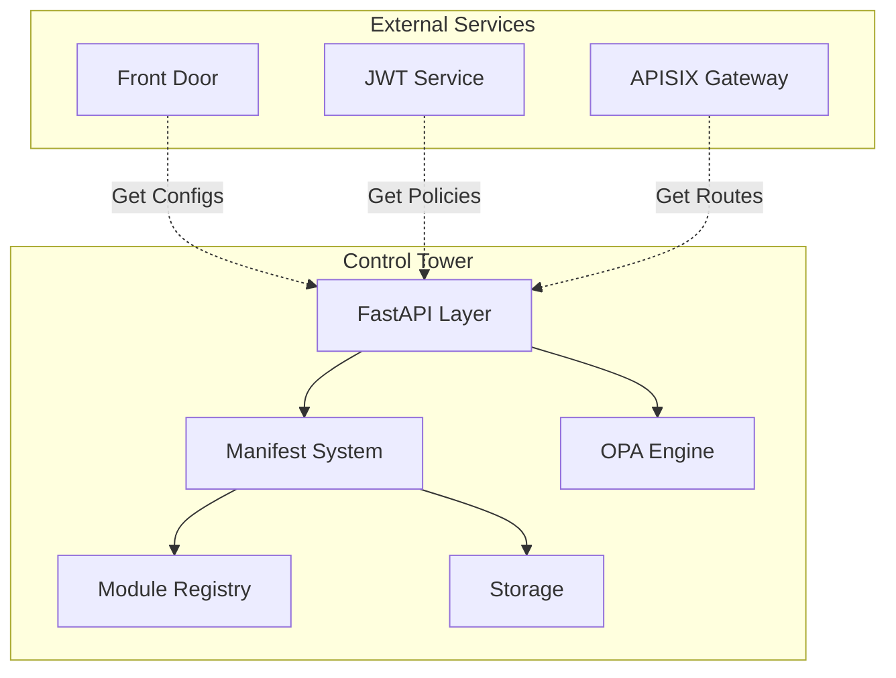
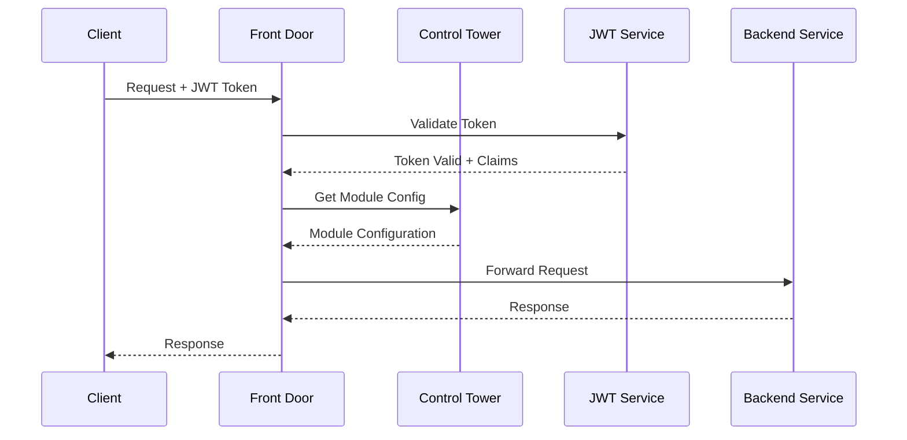
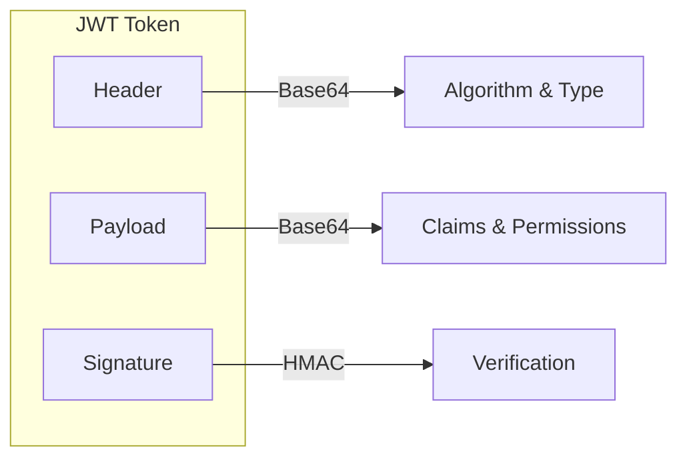

# Visual Assets Creation Guide

## 🎨 Architecture Diagrams

### Control Tower Architecture


### Front Door Request Flow


### JWT Token Structure


---

## 🖼️ Slide Templates

### Title Slide
```
┌─────────────────────────────────────┐
│                                     │
│     DSP AI Platform Tutorials      │
│                                     │
│    [COMPONENT NAME]                 │
│    Episode XX: [TITLE]              │
│                                     │
│    🚀 [Subtitle/Description]        │
│                                     │
└─────────────────────────────────────┘
```

### Section Divider
```
┌─────────────────────────────────────┐
│                                     │
│                                     │
│        Section Name                 │
│        ____________                 │
│                                     │
│        Key Points:                  │
│        • Point 1                    │
│        • Point 2                    │
│        • Point 3                    │
│                                     │
└─────────────────────────────────────┘
```

### Code Example Slide
```
┌─────────────────────────────────────┐
│  Configuration Example              │
├─────────────────────────────────────┤
│                                     │
│  ```json                            │
│  {                                  │
│    "key": "value",                  │
│    "nested": {                      │
│      "property": true               │
│    }                                │
│  }                                  │
│  ```                                │
│                                     │
└─────────────────────────────────────┘
```

---

## 🎯 Annotation Examples

### Highlight Box
```css
/* CSS for highlight overlay */
.highlight-box {
    border: 3px solid #00ff00;
    background: rgba(0, 255, 0, 0.1);
    border-radius: 5px;
    animation: pulse 2s infinite;
}

@keyframes pulse {
    0% { opacity: 1; }
    50% { opacity: 0.5; }
    100% { opacity: 1; }
}
```

### Arrow Pointer
```svg
<svg width="100" height="50">
    <defs>
        <marker id="arrowhead" markerWidth="10" markerHeight="7" 
                refX="9" refY="3.5" orient="auto">
            <polygon points="0 0, 10 3.5, 0 7" fill="#ff0000" />
        </marker>
    </defs>
    <line x1="0" y1="25" x2="80" y2="25" 
          stroke="#ff0000" stroke-width="3" 
          marker-end="url(#arrowhead)" />
</svg>
```

### Callout Bubble
```svg
<svg width="200" height="100">
    <rect x="10" y="10" width="180" height="60" 
          rx="10" fill="#fffacd" stroke="#333" stroke-width="2"/>
    <path d="M 50 70 L 40 90 L 60 70" fill="#fffacd"/>
    <text x="100" y="45" text-anchor="middle" 
          font-family="Arial" font-size="14">Important Note!</text>
</svg>
```

---

## 🎬 Animation Concepts

### Module Loading Animation
```
Frame 1: Empty module slot
Frame 2: Module sliding in from right
Frame 3: Module connecting with glow effect
Frame 4: Module active with pulsing indicator
```

### Request Flow Animation
```
Step 1: Request icon appears at client
Step 2: Arrow moves from client to gateway
Step 3: Gateway processes (spinning icon)
Step 4: Arrow continues to service
Step 5: Response flows back (different color)
```

### Token Validation Animation
```
1. Token arrives (fade in)
2. Token splits into 3 parts
3. Signature verification (checkmark)
4. Claims extraction (expand)
5. Success indicator (green glow)
```

---

## 🎨 Color Scheme

### Primary Colors
```css
:root {
    --primary-blue: #2E86AB;
    --primary-green: #A5BE00;
    --primary-orange: #F24236;
    --primary-purple: #7B68EE;
}
```

### Component Colors
- **Control Tower**: Blue (#2E86AB)
- **Front Door**: Green (#A5BE00)
- **JWT Service**: Orange (#F24236)
- **Integration**: Purple (#7B68EE)

### Status Colors
- **Success**: #28a745
- **Warning**: #ffc107
- **Error**: #dc3545
- **Info**: #17a2b8

---

## 📐 Diagram Tools Commands

### Draw.io/Diagrams.net
1. Create new diagram
2. Select "Blank Diagram"
3. Use these settings:
   - Grid: On
   - Grid Size: 10px
   - Page Format: 16:9 (1920x1080)

### Excalidraw
```javascript
// Excalidraw settings
{
    "gridSize": 20,
    "theme": "light",
    "exportBackground": true,
    "exportScale": 2,
    "font": "Virgil"
}
```

### Mermaid Live Editor
```markdown
# Use for quick diagrams
https://mermaid.live/

# Export settings:
- Format: SVG or PNG
- Theme: Default or Dark
- Background: Transparent
```

---

## 🖼️ Screenshot Guidelines

### Terminal Screenshots
```powershell
# Windows Terminal settings for screenshots
{
    "profiles": {
        "defaults": {
            "fontSize": 16,
            "fontFace": "Cascadia Code",
            "colorScheme": "One Half Dark",
            "cursorShape": "filledBox"
        }
    }
}
```

### Code Editor Screenshots
```json
// VS Code settings for screenshots
{
    "editor.fontSize": 16,
    "editor.lineHeight": 24,
    "editor.minimap.enabled": false,
    "workbench.colorTheme": "One Dark Pro",
    "editor.renderWhitespace": "none",
    "editor.lineNumbers": "on"
}
```

### Browser Screenshots
- Zoom: 110-125%
- Remove bookmarks bar
- Use incognito/private mode
- Clear history/autofill
- Use clean profile

---

## 🎯 Quick Asset Creation

### PowerPoint Templates
1. **Slide Size**: 16:9 (1920x1080)
2. **Font**: Segoe UI or Arial
3. **Title Size**: 44pt
4. **Body Size**: 24-28pt
5. **Code Font**: Consolas or Courier New

### Thumbnail Creation
```python
# Python script for batch thumbnail creation
from PIL import Image, ImageDraw, ImageFont

def create_thumbnail(episode, title):
    # Create base image
    img = Image.new('RGB', (1280, 720), color='#2E86AB')
    draw = ImageDraw.Draw(img)
    
    # Add text
    font_large = ImageFont.truetype("arial.ttf", 72)
    font_small = ImageFont.truetype("arial.ttf", 48)
    
    draw.text((100, 200), f"Episode {episode}", 
              font=font_large, fill='white')
    draw.text((100, 350), title, 
              font=font_small, fill='#A5BE00')
    
    # Save
    img.save(f'thumbnail_{episode}.png')

# Generate thumbnails
episodes = [
    ("CT-01", "Control Tower Introduction"),
    ("FD-01", "Front Door Basics"),
    ("JWT-01", "JWT Authentication")
]

for ep, title in episodes:
    create_thumbnail(ep, title)
```

---

## 📦 Asset Export Settings

### Images
- **Format**: PNG for diagrams, JPG for photos
- **Resolution**: 1920x1080 minimum
- **DPI**: 72 for web, 300 for print
- **Compression**: Optimize for web

### Videos
- **Intro/Outro**: 3-5 seconds
- **Transitions**: 0.5-1 second
- **Format**: MP4 with alpha for overlays

### Icons
- **Format**: SVG preferred
- **Size**: 64x64, 128x128, 256x256
- **Style**: Consistent line weight

---

## 🎨 Brand Guidelines

### Logo Usage
- Always maintain aspect ratio
- Minimum clear space: 2x logo height
- Don't alter colors
- Provide on transparent background

### Typography
- **Headers**: Bold, Sans-serif
- **Body**: Regular, Sans-serif
- **Code**: Monospace
- **Minimum Size**: 14pt for readability

### Consistency Rules
1. Use same intro/outro for all videos
2. Maintain color scheme throughout
3. Use consistent icon style
4. Keep annotation style uniform
5. Use same transition effects

---

## 📚 Asset Libraries

### Free Resources
- **Icons**: [Lucide](https://lucide.dev/), [Heroicons](https://heroicons.com/)
- **Illustrations**: [unDraw](https://undraw.co/), [DrawKit](https://drawkit.com/)
- **Patterns**: [Hero Patterns](https://heropatterns.com/)
- **Gradients**: [uiGradients](https://uigradients.com/)

### Stock Assets
- **Unsplash**: High-quality photos
- **Pexels**: Free stock photos/videos
- **Pixabay**: Free images and videos
- **Freepik**: Vectors and PSDs

---

## 🛠️ Automation Scripts

### Batch Process Diagrams
```bash
#!/bin/bash
# Convert all draw.io files to PNG

for file in *.drawio; do
    drawio -x -f png -o "${file%.drawio}.png" "$file"
done
```

### Generate Title Cards
```python
# Auto-generate title cards for all episodes
import json

with open('episodes.json') as f:
    episodes = json.load(f)

for episode in episodes:
    generate_title_card(
        episode['code'],
        episode['title'],
        episode['duration']
    )
```

---

**Remember**: Consistent, professional visuals enhance learning and engagement!
